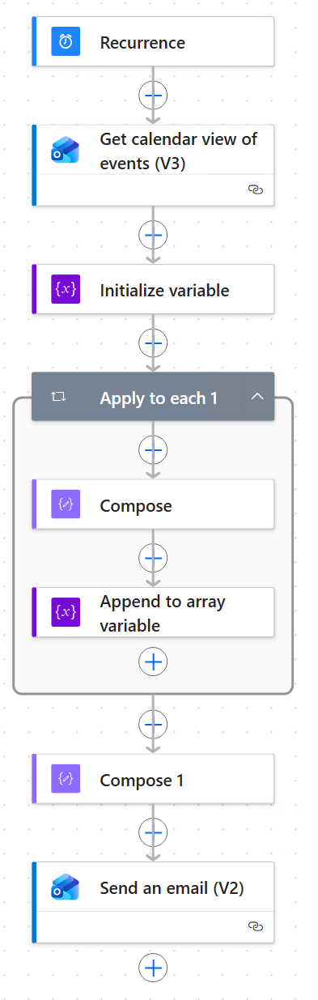
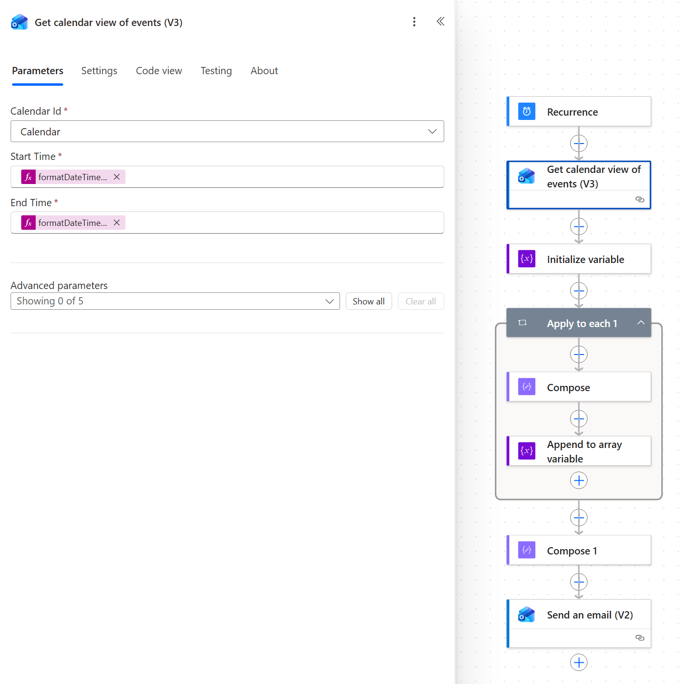
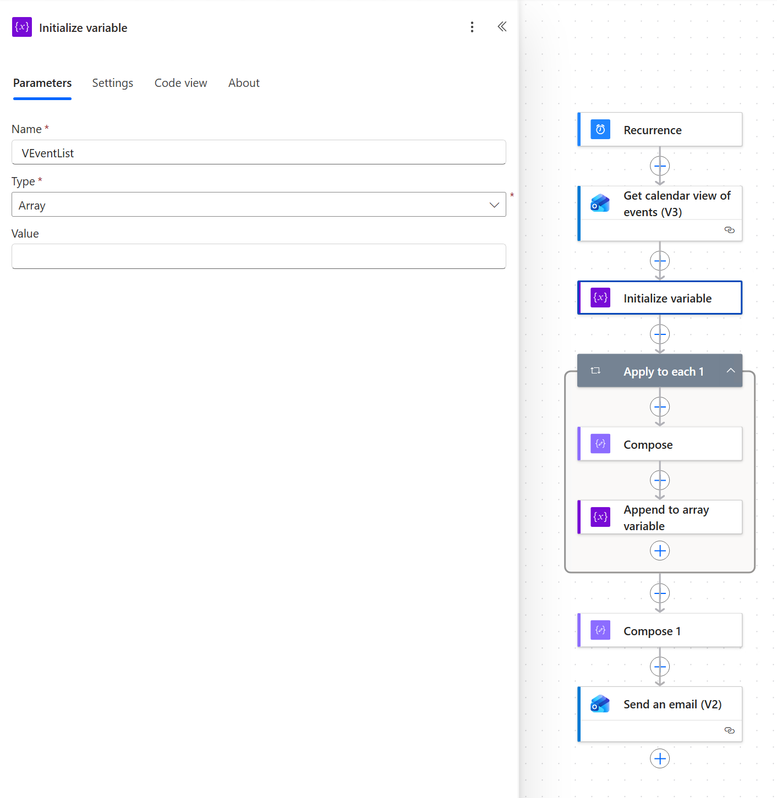
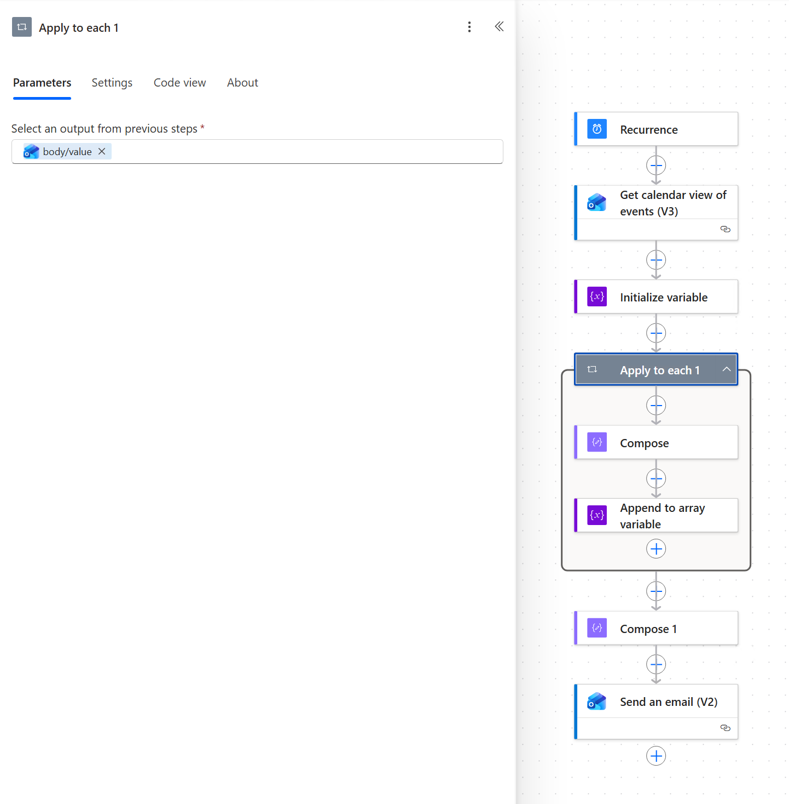
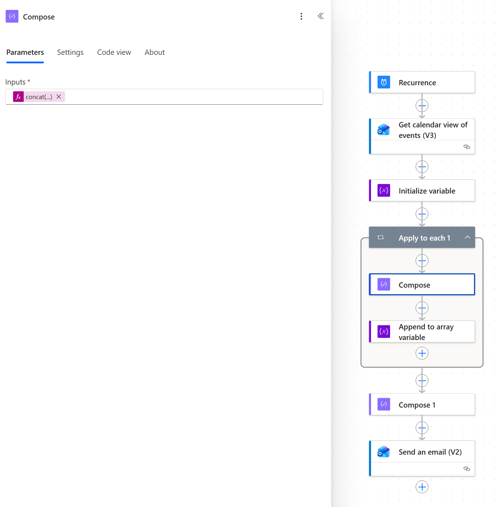
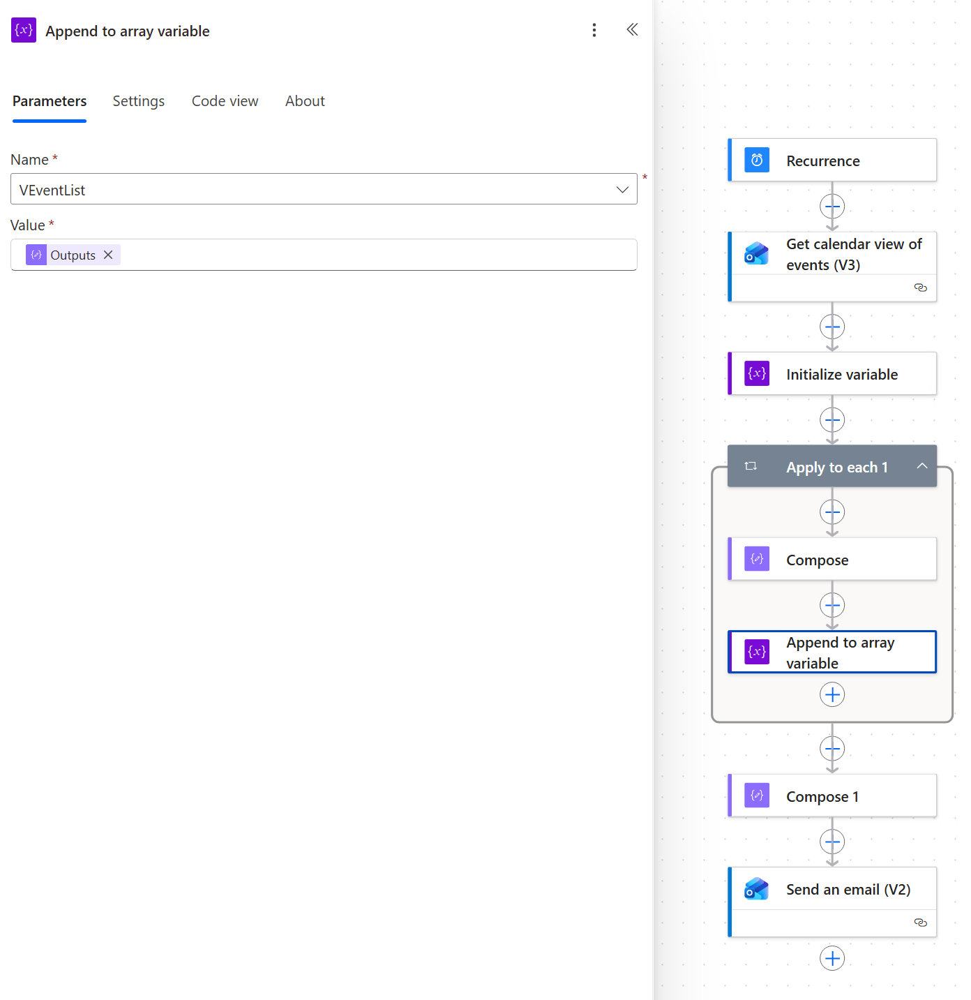
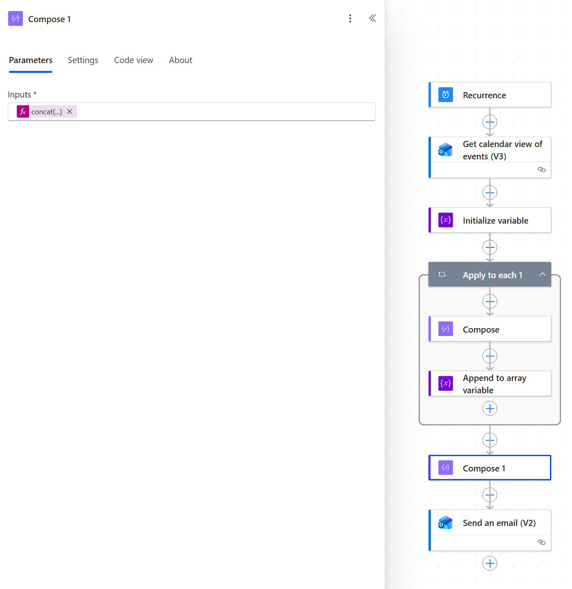
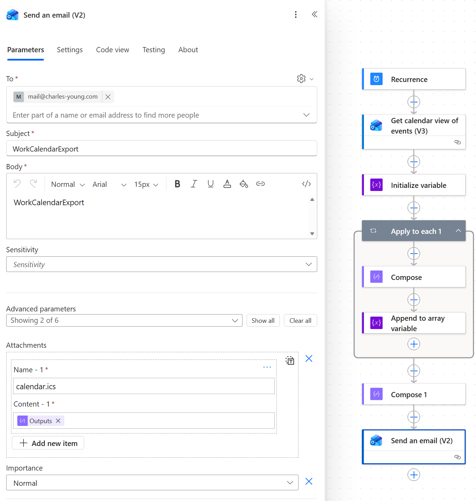

# Step 1: Build the weekly flow

This flow runs in your **work** Microsoft 365 account every **Sunday at
6 PM**. It reads the next 90 days of your calendar, turns each event into an
iCalendar `VEVENT`, wraps them in a `.ics` file, and emails that file to your
personal Fastmail address.

It sends a full snapshot. The sync adds or updates every event in it and
deletes any synced event in the 90-day window that isn't in it. The
[change flow](2-change-flow.md) keeps the calendar current between Sundays.

*This screenshot is from before the **Window start** step was added. Use the
table below for the current step list.*

| # | Step | Connector |
| --- | --- | --- |
| 1 | Recurrence | Schedule |
| 2 | Window start | Data Operations (Compose) |
| 3 | Get calendar view of events (V3) | Office 365 Outlook |
| 4 | Initialize variable | Variables |
| 5 | Apply to each 1 | Control |
| 5a | ↳ Compose | Data Operations |
| 5b | ↳ Append to array variable | Variables |
| 6 | Compose 1 | Data Operations |
| 7 | Send an email (V2) | Office 365 Outlook |

> [!IMPORTANT]
> **Step names matter.** The expressions refer to other steps by name:
> `Window_start`, `Apply_to_each_1`, `Compose`, `Compose_1`, and
> `Get_calendar_view_of_events_(V3)`. Power Automate turns spaces into
> underscores, so the loop must be called exactly **Apply to each 1**, and so
> on. If the designer gives a step a different name (for example, just
> "Apply to each"), rename it with the step's `⋮` menu → **Rename** *before*
> you paste the expressions.

## Pasting expressions

Every expression you need is in [`power-automate/expressions/`](../power-automate/expressions).
To use one:

1. Click in the field, then click the **fx** button (or type `/` and choose
   **Insert expression**).
2. Open the matching `.txt` file, copy **all** of it, and paste it into the
   expression box.
3. Click **Add**.

The Compose expressions span several lines on purpose. The line breaks inside
the quoted strings become the line breaks in the `.ics` file, so paste them
as they are. Don't reformat them onto one line.

---

## 1. Recurrence (trigger)

Create a new **Scheduled cloud flow**, or start from a blank flow and add the
**Schedule → Recurrence** trigger.

| Field | Value |
| --- | --- |
| Interval | `1` |
| Frequency | `Week` |
| Time zone | Your local time zone (mine is `(UTC-05:00) Eastern Time (US & Canada)`) |
| On these days | `Sunday` |
| At these hours | `18` |
| At these minutes | `0` |

"On these days", "At these hours" and "At these minutes" appear once
Frequency is set to Week. Leave Start time empty.

## 2. Window start

Add **Data Operations → Compose** and rename it to `Window start`.

| Field | Value |
| --- | --- |
| Inputs | expression: [`window-start.txt`](../power-automate/expressions/window-start.txt) |

This records the current time once, so the calendar query and the `.ics`
file both use the same 90-day window.

## 3. Get calendar view of events (V3)

Add **Office 365 Outlook → Get calendar view of events (V3)**.

| Field | Value |
| --- | --- |
| Calendar Id | Choose **Calendar** from the dropdown (your main calendar) |
| Start Time | expression: [`start-time.txt`](../power-automate/expressions/start-time.txt) |
| End Time | expression: [`end-time.txt`](../power-automate/expressions/end-time.txt) |

To sync further ahead, change `90` to a larger number of days. Change it in
`end-time.txt`, `compose-1-weekly.txt` and `compose-1-changes.txt` together.

Leave the advanced parameters empty. Use this action rather than "Get events":
the *calendar view* expands recurring meetings into individual occurrences,
and each occurrence gets its own `iCalUId`.

## 4. Initialize variable

Add **Variables → Initialize variable**.

| Field | Value |
| --- | --- |
| Name | `VEventList` |
| Type | `Array` |
| Value | *(leave empty)* |

## 5. Apply to each 1

Add **Control → Apply to each** and **rename it to `Apply to each 1`**.

| Field | Value |
| --- | --- |
| Select an output from previous steps | Dynamic content → **Get calendar view of events (V3)** → `body/value` (may be labelled **value**) |

### 5a. Compose (inside the loop)

Inside the loop, add **Data Operations → Compose**. Keep the name `Compose`.

| Field | Value |
| --- | --- |
| Inputs | expression: [`compose-vevent.txt`](../power-automate/expressions/compose-vevent.txt) |

This builds one `VEVENT` block per calendar event:

| iCal field | Comes from |
| --- | --- |
| `UID` | the event's `iCalUId`. It stays the same when the event changes, which lets the sync update the event instead of duplicating it. |
| `DTSTART` / `DTEND` | `start` / `end` in UTC. All-day events use date-only values. |
| `SUMMARY` | `subject` |
| `LOCATION` | `location` |
| `TRANSP` | `TRANSPARENT` when shown as *Free*, otherwise `OPAQUE` |
| `STATUS` | `TENTATIVE` when shown as *Tentative*, otherwise `CONFIRMED` |
| `X-WORKCAL-ID` | the Outlook event `id`. The change flow uses it to find events to update or delete. |
| `X-WORKCAL-SERIES-ID` | `seriesMasterId` for an occurrence of a recurring meeting, otherwise empty |

### 5b. Append to array variable (inside the loop, after Compose)

Add **Variables → Append to array variable**.

| Field | Value |
| --- | --- |
| Name | `VEventList` |
| Value | Dynamic content → **Compose** → `Outputs` |

## 6. Compose 1 (after the loop)

Add **Data Operations → Compose** *below and outside* the loop. It should be
named `Compose 1`.

| Field | Value |
| --- | --- |
| Inputs | expression: [`compose-1-weekly.txt`](../power-automate/expressions/compose-1-weekly.txt) |

This wraps all the `VEVENT`s in a `VCALENDAR` marked
`X-WORKCAL-SCOPE:SNAPSHOT`, along with the window it covers. Change `Charles`
in the `PRODID` line to your own name. It's only a label.

## 7. Send an email (V2)

Add **Office 365 Outlook → Send an email (V2)**.

| Field | Value |
| --- | --- |
| To | Your personal **Fastmail** address (mine is `mail@charles-young.com`) |
| Subject | `WorkCalendarExport` |
| Body | `WorkCalendarExport` (any text works) |
| Attachments Name - 1 | `calendar.ics` |
| Attachments Content - 1 | expression: [`attachment-content-bytes.txt`](../power-automate/expressions/attachment-content-bytes.txt) |
| Importance | Normal |

Attachment fields are under **Advanced parameters → Attachments**.

The designer shows the attachment content as an **Outputs** chip, as in the
screenshot, even though it's the `base64(...)` expression underneath. To
check it, open the step's **Code view**. `ContentBytes` should read
`@base64(outputs('Compose_1'))`.

The subject has to contain the sync script's `IMAP_SUBJECT_FILTER`, which
defaults to `WorkCalendar`.

---

## Save and test

1. **Save** the flow.
2. Click **Test → Manually → Test**.
3. Check that every step shows a green tick, and that an email with
   `calendar.ics` attached arrives in your Fastmail inbox.
4. Optional: open `calendar.ics` in a text editor. It should start with
   `BEGIN:VCALENDAR`, include `X-WORKCAL-SCOPE:SNAPSHOT`, and have one
   `BEGIN:VEVENT … END:VEVENT` block per meeting, each with an
   `X-WORKCAL-ID` line.

> [!TIP]
> Leave the test email **unread**. The GitHub Action only picks up unread
> emails, so this one will be your first real sync.

## Reference: full flow definition

[`power-automate/flow-weekly.json`](../power-automate/flow-weekly.json)
contains the whole flow as Power Automate stores it (each step's **Code
view**), except for the calendar ID, which is unique to each mailbox. You
can't import it directly, but you can use it to check your build step by step.

Next: **[Step 2: Build the change flow](2-change-flow.md)**
